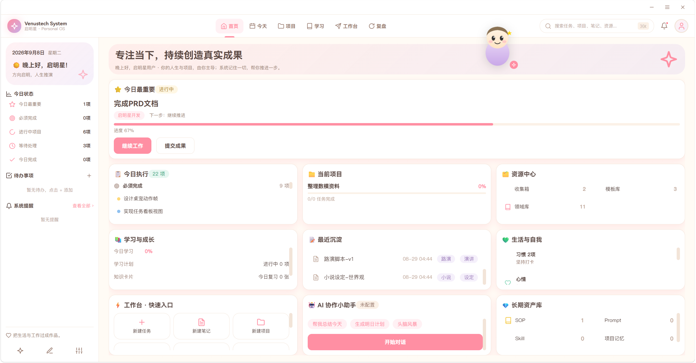

# Venustech System（启明星）

> **方向启明，人生推演** — AI 驱动的个人操作系统（Personal OS）
>
> 当前版本 **v0.7.0** · 13个功能模块 · 四套 UI 主题 · 本地优先 · 单机可用

---

## 产品预览



*奶油糖果主题 · 首页主面板 · 顶部导航 + 左侧信息栏 + 卡片式模块聚合*

---

## 项目简介

启明星是一款**本地优先的个人操作系统**，整合任务、项目、知识、复盘、生活记录与 AI 第二分身于统一入口。

核心理念是构建「**输入 → 处理 → 输出 → 沉淀 → 复用**」的个人复利闭环：

- **输入**：收集箱快速捕获、习惯打卡、心情记录、文档笔记
- **处理**：任务管理、项目推进、学习计划、SM-2间隔重复
- **输出**：复盘总结、长文写作、SOP执行、工作流一键应用
- **沉淀**：长期资产库（SOP/Prompt/Skill/项目记忆）、第二分身长期记忆
- **复用**：模板系统、工作流预设、知识图谱、灵感工作流

**核心差异化**：第二分身 —— 不是冰冷的工具，而是一个了解用户、会主动整理知识、以二次元桌宠形象陪伴的 AI 伙伴。

---

## 核心特性

| 特性 | 说明 |
|------|------|
| 🎯 **今日聚焦** | 今日最重要任务 + 进度追踪 + 继续工作一键直达 |
| 📋 **任务管理** | 列表/看板双视图、拖拽排序、任务依赖、模板系统 |
| 📚 **知识管理** | 文件夹层级、双向链接、版本历史、关系图谱、全文搜索 |
| 🤖 **第二分身** | 长期记忆（4类）、五档自动化（L1-L5）、灵感工作流、多模型切换 |
| 🐱 **桌宠陪伴** | 12种动作、桌宠/人形双形态、Marvis式状态感知、TTS语音、自定义形象 |
| 🔄 **间隔重复** | SM-2算法、3D翻卡复习、学习计划、时长统计 |
| ✅ **习惯打卡** | 连续天数、月历视图、心情记录、四维日记 |
| 📦 **资产沉淀** | SOP版本管理、Prompt模板、Skill技能库、项目记忆 |
| ⚡ **工作流系统** | 3套预设（数学学习/项目开发/小说写作）、一键应用引擎 |
| 🎨 **四套主题** | 奶油糖果 / 国风雅集 / 深渊档案 / 史诗典藏，每套支持明暗模式 |
| 🔒 **数据安全** | 本地优先、SQLite加密存储、备份导入导出、无数据量限制 |
| 🔌 **开放架构** | 插件系统、自定义模块、私人定制工作流 |

---

## 功能模块

### 一期核心（已完成）

- **首页 Dashboard**：三栏布局（左信息面板 + 顶导航 + 主内容），今日焦点/状态/执行/项目/最近沉淀一屏聚合；本周进度环、连续打卡徽章、卡片拖拽排序
- **任务 Task**：列表/看板双视图、拖拽换状态、子任务、优先级状态机、今日最重要、任务模板（5内置+自定义）、任务依赖关系
- **知识 Document**：文件夹层级、文档编辑器（三模式/自动保存）、标签、全文搜索、双向链接、模板系统、版本diff、文档关系图谱（SVG力导向图）
- **第二分身 Conversation**：SSE流式、8提示词模板 + /快捷触发、6套预设人设、多模型切换、用户画像沉淀、主动提醒系统、引用文档
- **复盘 Review**：热力日历、情绪趋势（双折线SVG）、复盘模板（日/周/月/项目）、复盘导出Markdown、年度复盘报告、明日计划转任务
- **项目 Project**：项目列表（8色/进度/状态）、项目详情页（5 Tab）、里程碑CRUD、归档/恢复、项目模板、项目时间线、项目导出（JSON+JSZip打包）

### 二期新模块（v0.7.0）

- **资源中心**：收集箱（捕获/处理/归档/转任务/转文档/批量处理）、模板库（{{变量}}替换引擎）、领域库
- **学习成长**：SM-2间隔重复算法、3D翻卡复习、学习计划、学习时长统计、今日复习队列
- **生活记录**：习惯打卡（连续天数+月历视图）、心情记录（5档评分+7天趋势）、四维日记（工作/学习/生活/成长）
- **长期资产库**：SOP流程（自动版本管理+版本历史）、Prompt模板（变量替换+评分）、Skill技能库、项目记忆
- **工作流系统**：3套预设工作流（数学学习/项目开发/小说写作）、一键应用引擎（自动创建标签/模板/任务）、应用历史
- **第二分身进化**：长期记忆（用户画像/知识记忆/事件记忆/关系记忆）、五档自动化（L1完全手动→L5完全自主）、灵感工作流（生成→提示词→执行→反馈）、模型配置
- **桌宠形象进化**：Marvis式状态感知（时间/任务/心情三维度）、本地TTS语音（浏览器SpeechSynthesis）、自定义形象管理、显示/互动/语音设置

### 待开发（后续方向）

- 强AI能力扩展：任务自动拆解、RAG知识问答、长文写作助手
- 本地模型推理接入：Ollama / LM Studio 完全离线推理
- Electron桌面端打包：Windows安装包、自动更新、全局快捷键、真桌宠窗口
- 云端同步：多设备数据同步、端到端加密
- 移动端适配：iOS / Android

---

## 技术栈

| 层 | 技术 |
|----|------|
| **后端** | FastAPI + SQLAlchemy 2.0 + SQLite(WAL/NullPool) + Alembic + loguru |
| **前端** | Vue 3 + TypeScript严格模式 + Vite + Pinia + Vue Router(Hash) + Element Plus（按需） + SCSS |
| **AI** | DeepSeek（OpenAI兼容，httpx自研客户端）；多模型切换（GPT/Claude/Ollama）；未配Key时本地规则降级 |
| **基础设施** | 事件总线（28种事件/异步/历史500条）、TTL内存缓存、插件系统（发现/加载/热重载）、加密存储（AES-128-CBC + HMAC + PBKDF2） |
| **部署** | 开发：8765后端 + 5173前端（一键脚本）；生产：Node统一服务单端口3000（API代理 + 静态资源） |

### 架构分层

```
API层 (api/) → Service层 (services/) → Repository层 (repositories/) → Model层 (models/)
   ↓                ↓                      ↓                          ↓
22个路由        15+业务逻辑             29个数据访问                30+数据表
```

---

## 目录结构

```
VenustechSystem/
├── backend/                 FastAPI 后端
│   ├── app/
│   │   ├── main.py          应用入口（lifespan：迁移/种子/事件订阅）
│   │   ├── core/            核心：event_bus / plugin_manager / encryption / config / cache
│   │   ├── api/             22个路由模块
│   │   ├── schemas/         Pydantic schema 层（20+文件）
│   │   ├── repositories/    数据访问层（29个Repository）
│   │   ├── services/        业务逻辑层（15+Service）
│   │   └── models/          数据模型（30+表）
│   ├── migrations/          Alembic 迁移（0001-0011）
│   └── scripts/             冒烟测试
├── frontend/                Vue3 前端
│   └── src/
│       ├── views/           15个视图页面
│       ├── api/             HTTP API 层（15模块 + http封装/SSE）
│       ├── composables/     业务逻辑（15+个useXxx）
│       ├── components/      组件（common基础 + layout壳 + pet桌宠 + 业务组件）
│       └── styles/          主题变量（4套主题 × 明暗模式）
├── docs/                    文档
│   ├── design/              PRD / 技术架构 / UI组件画廊（4套主题）
│   ├── prd/                 9模块深度开发PRD（M01-M09）
│   ├── frontend/            前端开发说明
│   ├── backend/             后端开发说明
│   ├── management/          进度评估 / 决策日志 / 考校报告
│   └── assets/              截图等资源
├── scripts/                 开发脚本（check_all.py 一键校验等）
├── server.js                统一Web服务（生产：静态 + /api代理）
├── CHANGELOG.md             变更日志
└── README.md                本文件
```

---

## 快速开始

### 环境要求

- Python 3.11+
- Node 18+
- （可选）[uv](https://docs.astral.sh/uv/)：安装后端依赖更快

### 首次安装依赖（只做一次）

双击 **`setup.bat`**，或命令行执行：

```bash
setup.bat
```

它会：创建 `backend\.venv` → 安装 `backend/requirements.txt` → `npm install`。
**它不会碰 git**（旧版初始化脚本会执行 `git add -A && git commit`，已移除）。

### 一键启动（开发模式）

双击 **`start-dev.bat`**，或命令行执行：

```bash
powershell -ExecutionPolicy Bypass -File scripts\dev.ps1
```

自动启动：后端 8765 + 前端 5173 + 打开浏览器。

> ⚠️ 后端依赖装在 `backend\.venv`，脚本会**优先使用该 venv 的解释器**。
> 直接跑 `python -m uvicorn` 用的是 PATH 上的系统 Python，通常缺
> fastapi/uvicorn，会立刻 `ModuleNotFoundError` 退出。

### 手动启动

```bash
# 后端（注意用 venv 里的 python）
cd backend
.venv\Scripts\python.exe -m uvicorn app.main:app --host 127.0.0.1 --port 8765 --reload

# 前端（新开终端）
cd frontend
npm run dev   # http://localhost:5173
```

### 生产 / 局域网 / 手机访问

```bash
cd frontend && npm run build && cd ..
node server.js
# → http://<本机IP>:3000 （前端 + /api 代理到 8765）
```

手机端（Tailscale 或同一 WiFi）：双击 **`start-mobile.bat`** ——
它会生成/读取访问令牌、构建 dist、起后端与统一服务，并把令牌打印出来，
在 App 的「设置 → 服务器地址」页填一次即可。

> `/api/*` 需要 `X-API-Token` 请求头（本机回环来源豁免，PC 前端零配置）。
> 服务监听 `0.0.0.0`，同网络设备都可访问；开放 WiFi 下建议改用 Tailscale。

### 验证

```bash
# 一键全量校验（架构守护 / 冒烟 / 版本一致性 / 设计引用 /
#                类型检查 / 离线队列 / HTTP 连通性 —— 共 7 项）
python scripts/check_all.py

# 单项
cd backend && python scripts/smoke_backend.py     # 后端端到端断言
cd frontend && npm run typecheck                  # 前端类型检查
python scripts/audit_hardcoded_colors.py          # 硬编码颜色审计
```

### 脚本一览

| 脚本 | 用途 |
|---|---|
| `setup.bat` | 首次安装依赖（venv + pip + npm），**不碰 git** |
| `start-dev.bat` | 开发启动：后端 8765 + 前端 5173 + 开浏览器 |
| `start-mobile.bat` | 手机/局域网：后端 + 统一服务 3000 + 打印访问令牌 |
| `push-branches.bat` | 推送 main + 8 个模块分支 + tag（网络不稳时重跑） |
| `scripts/dev.ps1` | 开发启动（PowerShell 版，支持 `-DataDir` 隔离数据目录） |

---

## UI 主题

四套主题深度对齐，每套52组件，支持明暗模式切换：

| 主题 | 风格 | 预览 |
|------|------|------|
| 🍬 **奶油糖果** | 明亮温暖、圆润可爱 | [查看](docs/design/UI组件画廊-奶油糖果.html) |
| 🏮 **国风雅集** | 中国古典、水墨意境 | [查看](docs/design/UI组件画廊-国风雅集.html) |
| 🌊 **深渊档案** | 海洋神秘、深邃静谧 | [查看](docs/design/UI组件画廊-深渊档案.html) |
| ⚔️ **史诗典藏** | 明亮传说、史诗感（暗色作暗夜模式） | [查看](docs/design/UI组件画廊-史诗典藏.html) |

---

## 文档

| 文档 | 说明 |
|------|------|
| [PRD v1.0（一期）](docs/design/PRD-启明星系统-v1.0.md) | 一期产品需求文档（2993行） |
| [PRD v2.0（二期）](docs/design/PRD-启明星系统-v2.0-二期.md) | 二期产品需求文档（1948行，约40页） |
| [技术架构 v2.0](docs/design/02-技术架构-v2.0.md) | 系统架构设计 |
| [模块深度开发PRD](docs/prd/00-模块深度开发PRD总览.md) | M01-M09模块详细设计 |
| [一期模块考校报告](docs/management/一期模块考校报告-2026-09-06.md) | 考校评分85/100，5个问题修复 |
| [三交付物融合方案](docs/management/三交付物融合方案-2026-09-15.md) | 外部交付物内核融合方案（四条融合线 / 分期路线 / 决策点） |
| [地球Online内核融入效果评估](docs/management/地球Online内核融入效果评估-2026-09-15.md) | 成长体系与领域知识库的逐块效果评估（含实测数据） |
| [前端开发说明](docs/frontend/前端开发说明.md) | 前端架构与开发规范 |
| [后端开发说明](docs/backend/后端开发说明.md) | 后端架构与开发规范 |
| [变更日志](CHANGELOG.md) | 版本更新记录 |
| [贡献指南](CONTRIBUTING.md) | 参与开发指南 |

---

## 数据安全

- **本地优先**：所有数据存储在本地SQLite，无需联网即可使用
- **加密存储**：AES-128-CBC + HMAC + PBKDF2密钥派生，敏感数据加密
- **备份导出**：支持完整数据备份与恢复，无数据量限制
- **隐私保护**：第二分身记忆完全本地存储，不上传任何服务器
- **AI可选**：未配置API Key时，所有AI功能自动降级为本地规则引擎

---

## 许可证

个人项目，保留所有权利。仅供学习和个人使用。

---

> **方向启明，人生推演** — 让个人数据真正为你工作


